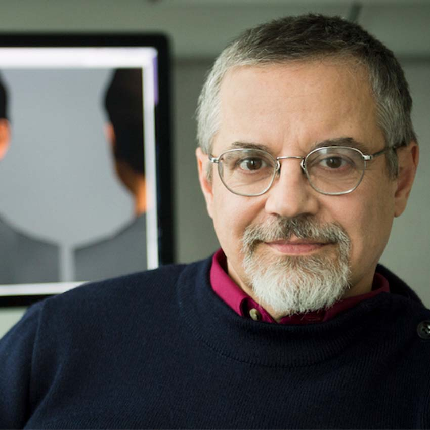

<section class="hero project-hero">
  

    

      
      
    

    
NSF DREAM RESEARCH APPRENTICESHIP 2026

    <h1>Multimodal Human-Robot Interaction for Socially Grounded Environments</h1>
    

      

        
        Julee Chung
      

      

        
        Prof. Zhi Tan
      

      

        
        Prof. Stacy Marsella
      

    

    
Khoury College of Computer Science, <strong>Northeastern University</strong>, Boston MA

  

</section>

<nav class="section-nav" aria-label="Page sections">
  <a href="#project">Research Introduction</a>
  <a href="#about-me">About Me</a>
  <a href="#advisor">Advisors</a>
  <a href="#blog">Journal</a>
</nav>

<section class="content-section" id="project">
  <h2>Research Introduction</h2>

  
Robots have the potential to support people in shared physical environments, but they often struggle to understand the flexible, situated ways humans communicate. Simple references like "this," "that," or "over there" can depend on speech, gesture, spatial context, and shared attention.

  
This research investigates multimodal human-robot interaction using Boston Dynamics' Spot robot, examining how robots can combine speech, gesture, and environmental context to interpret human intent and respond more naturally in socially grounded environments.

  
The broader goal is to develop interaction patterns that make robots easier to understand, direct, and collaborate with in shared spaces. I am especially interested in extending this work toward museum environments, where robots could support wayfinding, accessibility, visitor engagement, and behind-the-scenes workflows while respecting the social and cultural complexity of public institutions.

  
Project materials are maintained in the <a href="https://github.com/juleechung/gesturehri">gesturehri repository</a>. My research journal tracks weekly progress, including design decisions, implementation work, experimental findings, and open questions.

  
<a href="final-report.html">Final Report</a>

</section>

<section class="content-section" id="about-me">
  <h2>About Me</h2>

  
I am an M.S. Computer Science student at Northeastern University researching multimodal human-robot interaction with Boston Dynamics' Spot robot through the NSF DREAM program. My work is advised by Professors Stacy Marsella and Zhi Tan and focuses on socially grounded robot communication in real-world settings.

  
Before computer science, I worked for nearly a decade across museums, publishing, and digital products. I was editor of M+ Museum in Hong Kong, where I shaped institutional voice across publications, exhibitions, programs, and digital interfaces, including UX writing for the museum's Red Dot Design Award-winning website. I previously worked as assistant editor at <em>ArtAsiaPacific</em> magazine and studied painting at the Rhode Island School of Design and art history at the Courtauld Institute of Art.

  
I plan to graduate from Northeastern in 2027. I am fluent in English and Korean and am interested in research at the intersection of robotics, computer vision, human-centered AI, and cultural contexts for intelligent systems.

</section>

<section class="content-section" id="advisor">
  <h2>Advisors</h2>

  
This research is co-advised by professors <a href="https://zhi.fyi/">Zhi Tan</a> and <a href="https://www.khoury.northeastern.edu/people/stacy-c-marsella/">Stacy C. Marsella</a>, and carried out of <a href="https://parcslab.fyi/">PARCS Lab</a> and <a href="https://www.cesarlab.org/">CESAR Lab</a>.

  
Professor Tan's research explores human-robot interaction, assistive robotics, and how robots can collaborate with people, other robots, and intelligent systems in real-world contexts.

  
Professor Marsella's research focuses on computational models of cognition, emotion, and social behavior, with applications in virtual humans, social agents, and human-centered systems.

</section>

<section class="content-section" id="blog">
  <h2>Research Journal</h2>

  
Documenting project goals, implementation progress, findings, and open questions.

  
<a href="blog.html">View Journal</a>

</section>
